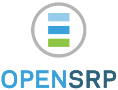

 

To run this project, you need to do this:
========================================

1. Set the ANDROID\_HOME environment variable to point to the location of your installed Android SDK 4.1.2 API level 16. For more information, look at [the documentation of maven-android-plugin](http://code.google.com/p/maven-android-plugin/wiki/GettingStarted).

2. Start an Android Virtual Device. Normally, this means you need to run "android avd" and then start one of the devices there.

Then, you can run "mvn clean install" in the main directory.

Tips and tricks (to be completed):
=================================

* How to setup your Android SDK so that Maven finds it: http://pivotal.github.com/robolectric/maven-quick-start.html

* Adding an external Android library (apklib) as a submodule, and making it work with both Maven and IntelliJ. Write about "mvn clean" trick.

Login (for demo server):
=================================
login-username - demotest,
login-password - Demot123

Check app.properties file in "drishti-app/asset/" folder to change the demo server url to your own instance of opensrp server.
